# Deepfake Tespit Sistemi

Bir videoyu (.mp4) yükleyip **gerçek mi sahte mi** olduğunu söyleyen bir
masaüstü ve web uygulaması. Karar yalnız görüntüye bakarak değil; videodaki
**yüz hareketleri**, **ses** ve **frekans izleri** üç ayrı modelle paralel
analiz edilip oylanarak veriliyor.

**Tek cümle sonuç:** FaceForensics++ c23 test setinde (751 video)
**%94.14 doğruluk** elde edildi; farklı bir veri setinde (Celeb-DF v2)
domain kayması altında bile **AUC 0.8393** ile çekirdek referansın
(Qiao et al. 2025, AUC 0.7468) **+9.25 puan üzerinde**.

> Batuhan Kaya · 232923023

---

## İçindekiler

1. [Hızlı Başlangıç](#1-hızlı-başlangıç)
2. [Sistem Nasıl Çalışır?](#2-sistem-nasıl-çalışır)
3. [Sonuçlar](#3-sonuçlar)
4. [Detaylı Analiz](#4-detaylı-analiz)
5. [Sınırlamalar](#5-sınırlamalar)
6. [Kurulum ve Kullanım](#6-kurulum-ve-kullanım)
7. [Proje Yapısı](#7-proje-yapısı)
8. [Referanslar](#8-referanslar)

---

## 1. Hızlı Başlangıç

```bash
git clone https://github.com/batuankaya/deepfake-detection.git
cd deepfake-detection
pip install -r requirements.txt
```

**Web arayüzü** (önerilen):

```powershell
.\scripts\run_streamlit.ps1                    # Windows
streamlit run app/streamlit_app.py     # diğer
```

Tarayıcıdan `http://localhost:8501` → `.mp4` yükle → "Gerçek / Sahte" + güven skoru.

**Komut satırı:**

```bash
python scripts/predict_cli.py <video.mp4>           # okunabilir çıktı
python scripts/predict_cli.py <video.mp4> --json    # JSON çıktı
```

Daha fazla detay: [§6 Kurulum ve Kullanım](#6-kurulum-ve-kullanım).

---

## 2. Sistem Nasıl Çalışır?

Sistem aynı videoyu **üç farklı bakış açısıyla** inceler ve üç bağımsız
kararı bir füzyon katmanında birleştirir:

```
                    ┌─────────────────┐
                    │   Video Girdi   │
                    │     (.mp4)      │
                    └────────┬────────┘
                             │
              ┌──────────────┼──────────────┐
              ▼              ▼              ▼
     ┌────────────┐  ┌────────────┐  ┌────────────┐
     │  GÖRÜNTÜ   │  │    SES     │  │  FREKANS   │
     │ EffNet-B4  │  │ Mel-Spekt. │  │ Block DCT  │
     │ + Bi-LSTM  │  │ + CNN      │  │ + Multi-sc.│
     └─────┬──────┘  └─────┬──────┘  └─────┬──────┘
           └───────────────┼───────────────┘
                           ▼
                ┌─────────────────────┐
                │   FÜZYON KATMANI    │
                │  EER kalibrasyonu + │
                │  AUC-ağırlıklı oy + │
                │  STRONG_FAKE kuralı │
                └──────────┬──────────┘
                           ▼
                ┌─────────────────────┐
                │  Gerçek / Sahte +   │
                │     güven skoru     │
                └─────────────────────┘
```

| Modül | Neye Bakar? | Hangi Modelle? |
|---|---|---|
| **Görüntü** | Yüzdeki mimik, ışık, doku tutarsızlıkları | EfficientNet-B4 + Bi-LSTM |
| **Ses** | Robotik / sentetik ses izleri | Mel-Spektrogram + CNN |
| **Frekans** | GAN / difüzyon modellerinin yüksek frekansta bıraktığı izler | Block-wise DCT + Multi-scale CNN |
| **Füzyon** | Üç modülün kararını birleştirir | EER kalibre + AUC ağırlığı + güçlü kanıt kuralı |

**Füzyondaki üç kural ne anlama gelir?**

1. **EER kalibrasyonu** — her modülün ham olasılığını ortak bir eşiğe çekerek "p=0.8" demenin her modülde aynı anlama gelmesini sağlar.
2. **AUC-ağırlıklı oy** — daha güvenilir modülün (yüksek AUC) oyu daha fazla sayılır.
3. **STRONG_FAKE kuralı** — bir modül çok yüksek güvenle (p ≥ 0.85) "sahte" diyorsa, diğerleri "gerçek" dese bile karar SAHTE olur. Çünkü **kaçırılmış bir deepfake**, yanlış alarmdan çok daha pahalı bir hatadır.

> **Neden eğitilebilir hiyerarşik füzyon değil?** Referans makaledeki o
> yöntem her örnekte görüntü + ses + frekans'ın **birlikte** olmasını ister.
> Bizim veri setlerimiz heterojen (FF++ ve Celeb-DF sessiz, ASVspoof yalnız
> ses); o yüzden modalite-eksik durumda çalışabilen karar-seviyesi füzyon
> tercih edildi. Detay: [`docs/proje_onerisi.md`](docs/proje_onerisi.md).

---

## 3. Sonuçlar

### 3.1. Modül Bazında Başarı

| Modül | Test AUC | Test F1 | Test EER | Celeb-DF Cross AUC | Cross EER |
|---|:---:|:---:|:---:|:---:|:---:|
| **Ses** (Mel-CNN) | **0.9806** | **0.9594** | 0.0706 | — | — |
| **Frekans** (Block-DCT) | 0.8927 | 0.8522 | 0.2208 | 0.7353 | 0.3295 |
| **Görüntü** (EffNet-B4 + BiLSTM) | **0.9812** | **0.9588** | **0.0616** | **0.8393** | 0.2461 |

> Frekans/görüntü F1 değerleri FF++ test setinde **video bazında**
> (751 video, `reports/analysis/ablation.json`). Ses F1 ise ASVspoof
> eval'de segment seviyesinde — FF++ videoları sessizdir.

### 3.2. Füzyon — FF++ c23 Test Seti (751 video)

| Metrik | Değer |
|---|:---:|
| **Doğruluk (Accuracy)** | **%94.14** |
| **F1 skoru** | **0.9628** |
| **Hassasiyet (Precision)** | %97.93 |
| **Duyarlılık (Recall)** | %94.68 |

Füzyon, en güçlü tek modülü (%93.61) **+0.53 puan** geçerek tüm konfigürasyonlar arasında en iyi sonucu verdi.

### 3.3. Hata Metrikleri (Karışıklık Matrisi)

|  | Tahmin: GERÇEK | Tahmin: SAHTE |
|---|:---:|:---:|
| **Gerçek: GERÇEK** | 138 ✓ (TN) | 12 ✗ (FP) |
| **Gerçek: SAHTE** | 32 ✗ (FN) | 569 ✓ (TP) |

| Hata | Oran | Ne demek? |
|---|:---:|---|
| **FPR** | %8.00 | Gerçek videoyu yanlışlıkla sahte sayma |
| **FNR** | %5.32 | Kaçırılmış deepfake — **en kritik hata** |
| **Toplam** | %5.86 | Genel yanlış sınıflandırma |

### 3.4. Literatürle Karşılaştırma (Celeb-DF v2)

| Çalışma | Yaklaşım | Acc | F1 | AUC |
|---|---|:---:|:---:|:---:|
| Qiao et al. (2025) — çekirdek ref | Spatial-Freq + Hier. Fusion | — | — | 0.7468 |
| Yıldırım (2025) — YÖK 957056 | ResNet18 (SSL) | %89.17 | %89.29 | — |
| **Bizim — görüntü** | EffNet-B4 + BiLSTM | %77.91 | %86.08 | **0.8393** |
| **Bizim — frekans** | Block-DCT + Multi-scale | %71.79 | %81.76 | 0.7353 |

- **AUC ekseninde** çekirdek referansı **+9.25 puan** geçtik (her ikisi de
  FF++ → Celeb-DF cross-dataset protokolünde).
- **Accuracy ekseninde** Yıldırım önde görünür; ancak tezinde (Bölüm 5.3)
  Celeb-DF v2 alt-kümesi üstünde **sıfırdan eğitim** yapıldığı belirtiliyor —
  yani bu **in-dataset** bir sonuç, bizim cross-dataset %77.91'imizle
  doğrudan karşılaştırılamaz. AUC ekseni eşik bağımsız olduğu için bu
  protokol farkından etkilenmez ([§4.3](#43-eşik-ve-kalibrasyon)).

<details>
<summary><b>ROC eğrileri ve karışıklık matrisleri</b> — tıklayarak aç</summary>

| | Ses | Frekans | Görüntü |
|---|---|---|---|
| **Test ROC** | 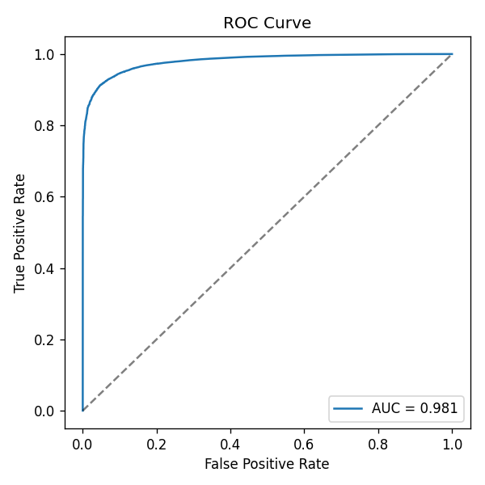 | 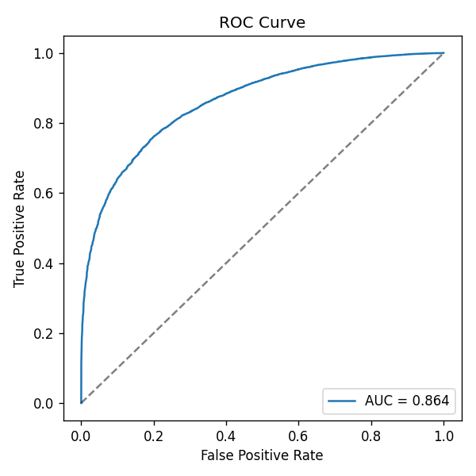 | 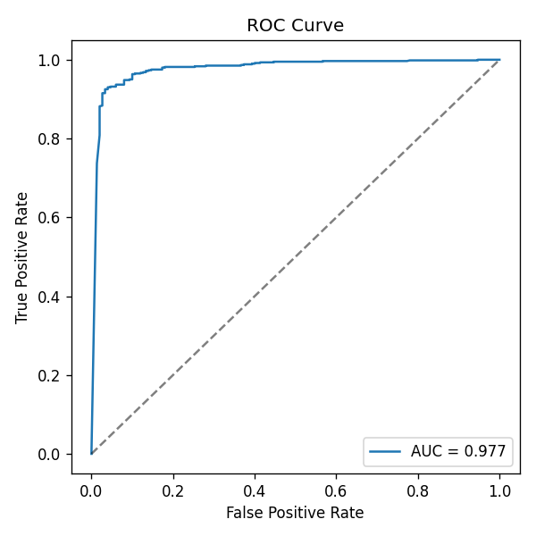 |
| **Test CM** | 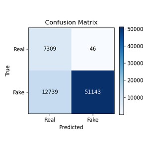 | 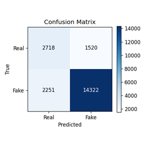 | 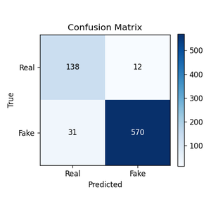 |
| **Cross ROC** | — | 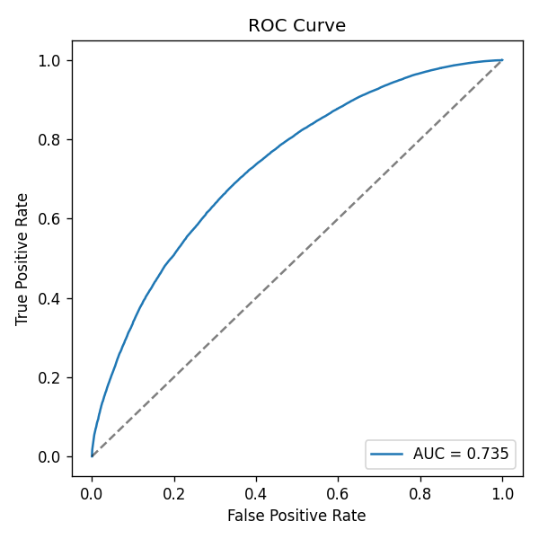 | 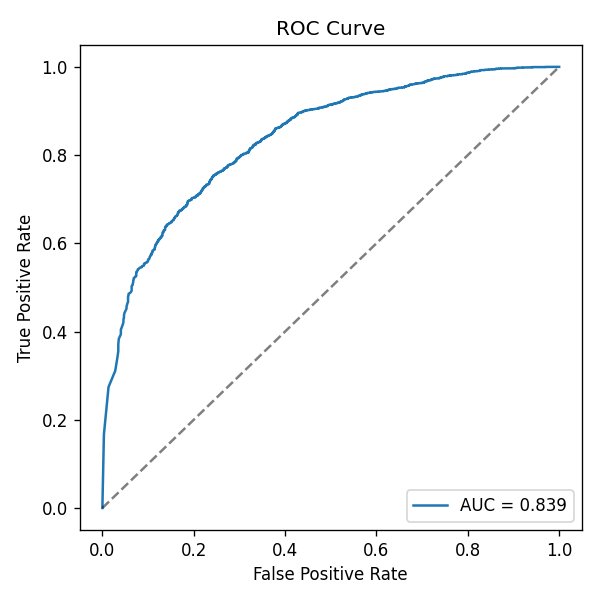 |
| **Cross CM** | — | 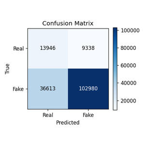 | 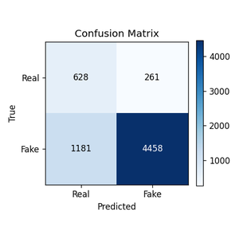 |

</details>

---

## 4. Detaylı Analiz

Tüm grafikler `reports/analysis/` altında; tekrar üretmek için scriptler [`scripts/`](scripts/README.md) klasöründe.

### 4.1. Füzyon Gerçekten Katkı Sağlıyor mu? (Ablation)

| Strateji | Accuracy | F1 |
|---|:---:|:---:|
| Yalnız görüntü modülü | %93.61 | %95.88 |
| Yalnız frekans modülü | %78.56 | %85.22 |
| Füzyon — eşit oylama | %93.87 | %96.09 |
| Füzyon — AUC ağırlıklı | %93.61 | %95.91 |
| **Füzyon — AUC + STRONG_FAKE** ✅ | **%94.14** | **%96.28** |

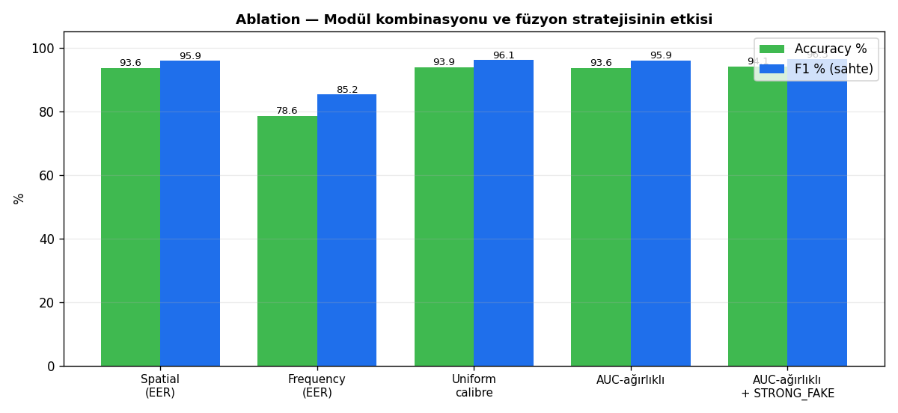

Asıl katkıyı **STRONG_FAKE override** veriyor (+0.27 puan). Bu sonuç "false negative en pahalı hatadır" tasarım gerekçesinin sayısal doğrulamasıdır.

### 4.2. Hangi Manipülasyon Tipi Zor?

| Manipülasyon Tipi | Recall | Kaçırılmış |
|---|:---:|:---:|
| FaceSwap | **%98.68** | 2/151 |
| Face2Face | %97.33 | 4/150 |
| Deepfakes | %96.00 | 6/150 |
| **NeuralTextures** | **%86.67** | **20/150** |

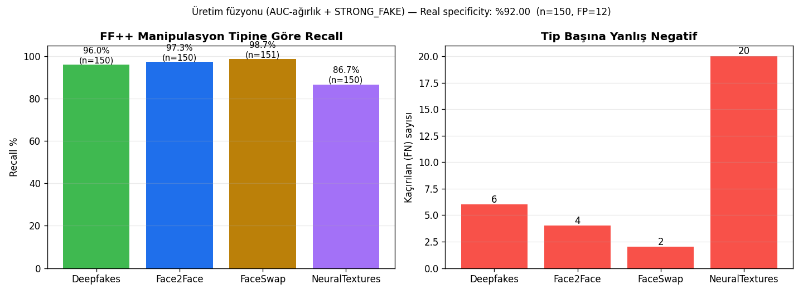

Kaçırılan tüm sahtelerin **%62'si NeuralTextures** (20/32). NT yalnız ağız bölgesini sentezleyen render tabanlı bir teknik; klasik deepfake izleri (yüz sınırı, sıkıştırma) zayıf kaldığı için zor. Hedefli iyileştirme öncelikle NT'ye gitmeli.

### 4.3. Eşik ve Kalibrasyon

**Cross-dataset accuracy düşüşünün gerçek sebebi:** model değil, eşik. Sınıf dağılımı 4:1 (fake:real) olduğu için Max-Acc eşiği EER'den çok daha düşük çıkar; EER eşiği ise recall-odaklı bir güvenlik duruşudur.

| Modül | EER eşiği | EER @ Acc | Max-Acc eşiği | Max-Acc |
|---|:---:|:---:|:---:|:---:|
| Görüntü | 0.785 | %93.74 | 0.080 | %95.34 |
| Frekans | 0.703 | %78.56 | 0.320 | — |

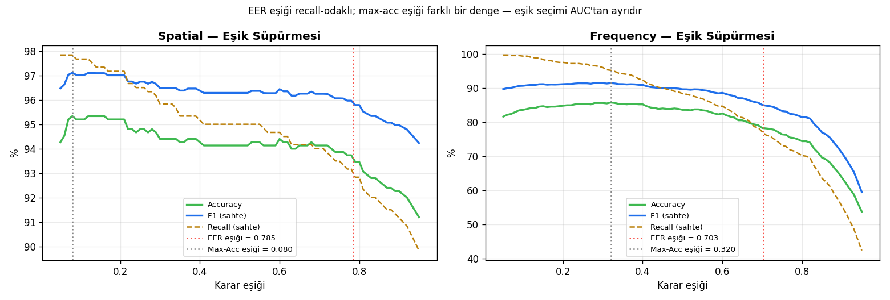

**Olasılık kalibrasyonu** — model `p=0.9` dediğinde gerçekten 9/10 doğru mu?

| Modül | Brier ↓ | ECE ↓ |
|---|:---:|:---:|
| Görüntü | **0.045** | **0.038** |
| Frekans | 0.108 | 0.064 |

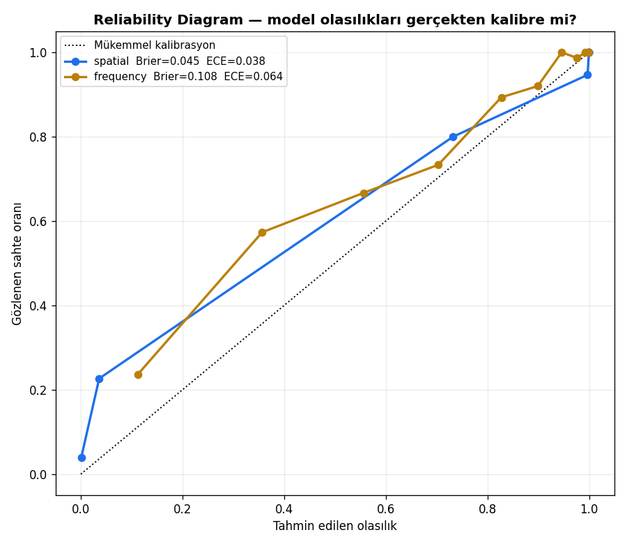

Görüntü modülü iyi kalibre; frekansın ham olasılığı doğrudan karar için güvenli değil — bu yüzden EER kalibrasyonu şart.

### 4.4. Güven Aralıkları — Sonuçlar Ne Kadar Kesin?

1000-resample bootstrap, %95 güven aralığı:

| Konfigürasyon | Accuracy | F1 | AUC |
|---|:---:|:---:|:---:|
| Görüntü-only @ EER | %93.62 [91.88, 95.34] | %95.89 [94.69, 97.02] | 0.9811 [0.9716, 0.9890] |
| Frekans-only @ EER | %78.60 [75.63, 81.49] | %85.23 [83.00, 87.25] | 0.8927 [0.8673, 0.9158] |
| **Füzyon (üretim)** | **%94.15 [92.41, 95.74]** | **%96.28 [95.12, 97.34]** | — |

Füzyon alt sınırı (%92.41) görüntü-only ortalamasının (%93.62) yalnız −1.21 puan altında — füzyon üstünlüğü istatistiksel olarak sağlam.

### 4.5. Vahşi-Doğa Testi — Eğitim Dışı Kaynaklar

Eğitim/test setinde **hiç olmayan** 5 kaynaktan rastgele 100 video (seed=7):

| Kaynak | Doğru | Oran |
|---|:---:|:---:|
| FF++ original (gerçek, eğitim-dışı ID) | 20/20 | **%100** |
| Celeb-DF v2 Celeb-real (gerçek) | 17/20 | %85 |
| FF++ DeepFakeDetection (Google DFD) | 14/20 | %70 |
| Celeb-DF v2 Celeb-synthesis | 12/20 | %60 |
| **FF++ FaceShifter (görülmemiş manipülasyon)** | **1/20** | **%5** |
| **Genel** | **64/100** | **%64.0** |

**Bulgular:**
- **Gerçek-tanıma sağlam** (%92.5). Modelin "yanlışlıkla sahte deme" eğilimi düşük.
- **Görülmemiş manipülasyon karşısında çöküyor** (FaceShifter %5). Model deepfake değil, eğitimde gördüğü 4 tekniğin parmak izini tespit ediyor.

Tam tablo: [`reports/analysis/wild_test.md`](reports/analysis/wild_test.md).

### 4.6. Hız (Inference Latency)

| Bileşen | CUDA (RTX 4070) | CPU |
|---|:---:|:---:|
| Kare çıkarma (ffmpeg) | 587 ms | 437 ms |
| Yüz tespiti (MTCNN) | 1794 ms | 1597 ms |
| Görüntü modülü | 55 ms | 237 ms |
| Frekans modülü | 186 ms | 2506 ms |
| Ses modülü | 816 ms | 805 ms |
| Füzyon | <1 ms | <1 ms |
| **Toplam (30 kare/video)** | **3.4 s** | **5.6 s** |

Batch/forensik analiz için elverişli; **gerçek-zamanlı değil**. Darboğaz MTCNN ve frekans modülü.

---

## 5. Sınırlamalar

Bilinen ve açıkça belgelenen boşluklar:

- **3-modüllü füzyon hiç doğrulanmadı.** Video setlerimiz sessiz, ASVspoof yalnız ses — fusion sayıları 2-modüllüdür (görüntü + frekans). Tam test multimodal bir set (DFDC, FakeAVCeleb) gerektirir.
- **Ses cross-corpus test edilmedi.** AUC 0.9806 ASVspoof eval protokolünde; farklı mikrofon/oda için ASVspoof 2021 lazım.
- **NeuralTextures en zayıf nokta** (recall %86.67).
- **Görülmemiş manipülasyona kırılgan** — FaceShifter testinde recall %5.
- **Gerçek-zamanlı değil** (3.4 s/video CUDA).
- **Frekans modülü kalibrasyonu zayıf** (Brier 0.108, ECE 0.064).
- **Sıkıştırma sağlamlığı (c40, RAW) ölçülmedi.**
- **Eğitilebilir hiyerarşik füzyon** (referans 1) uygulanmadı; gerekçe `docs/proje_onerisi.md`.

---

## 6. Kurulum ve Kullanım

### Kurulum

```bash
git clone https://github.com/batuankaya/deepfake-detection.git
cd deepfake-detection
python -m venv venv
.\venv\Scripts\activate            # Windows
source venv/bin/activate           # macOS / Linux
pip install -r requirements.txt
```

### Web Arayüzü

```powershell
.\scripts\run_streamlit.ps1                       # önerilen
streamlit run app/streamlit_app.py        # alternatif
```

Tarayıcı: `http://localhost:8501`. `.mp4` yükle → karar + güven skoru.

### Komut Satırı

```bash
python scripts/predict_cli.py <video.mp4>            # okunabilir
python scripts/predict_cli.py <video.mp4> --json     # JSON
```

### Eğitim

```bash
python -m src.train --config configs/config.yaml --module frequency
python -m src.train --config configs/config.yaml --module spatial
python -m src.train --config configs/config.yaml --module audio
```

Veri `data/processed/{train,val,test}/{real,fake}/` altında bekleniyor.

### Testler

```bash
python tests/test_models.py
```

---

## 7. Proje Yapısı

```
deepfake-detection/
├── app/                          # Streamlit web arayüzü
│   └── streamlit_app.py
├── src/                          # Çekirdek kütüphane
│   ├── inference.py              # Uçtan uca tahmin (fuse fonksiyonu burada)
│   ├── train.py / evaluate.py    # Eğitim ve değerlendirme
│   ├── cross_eval.py             # Cross-dataset değerlendirme
│   ├── fusion_eval.py            # Füzyon değerlendirme
│   ├── preprocessing/            # Video → kare, ses, yüz, dataset
│   ├── models/                   # spatial / audio / frequency / fusion
│   └── utils/                    # device, metrics, visualize
├── scripts/                      # CLI tahmin, başlatıcı .ps1, analiz scriptleri
├── reports/                      # Eğitim/değerlendirme çıktıları + grafikler
├── docs/                         # Proje raporu (.md + .pdf)
├── configs/                      # YAML konfigürasyonları
├── data/                         # Veri setleri (gitignore'da)
├── checkpoints/                  # Eğitilmiş model ağırlıkları (gitignore'da)
├── tests/                        # Birim testleri
├── requirements.txt              # Python bağımlılıkları
└── README.md                     # Bu dosya
```

`scripts/` ve `reports/` klasörlerinin kendi içlerinde README'leri vardır.

---

## 8. Referanslar

1. **Qiao, M., Tian, R., & Wang, Y. (2025).** Towards Generalizable Deepfake Detection
   with Spatial-Frequency Collaborative Learning and Hierarchical Cross-Modal
   Fusion. *arXiv:2504.17223.*
   [arxiv.org/abs/2504.17223](https://arxiv.org/abs/2504.17223)

2. **Yıldırım, M. (2025).** Öz Denetimli Öğrenme Yaklaşımları ile Derin
   Sahte Ses ve Görüntü Manipülasyonunun Tespiti. *Yüksek Lisans Tezi,
   Fırat Üniversitesi.* YÖK Tez No: 957056.

---

## Güvenlik

XSS koruması, dosya uzantı/boyut doğrulama (≤200 MB), path-traversal
kontrolü (`is_relative_to`), güvenli deserialization
(`np.load(allow_pickle=False)`, `yaml.safe_load`), geçici dosya
`try/finally` temizliği, dış kullanıcıya iç hata bilgisi sızdırılmaz.
